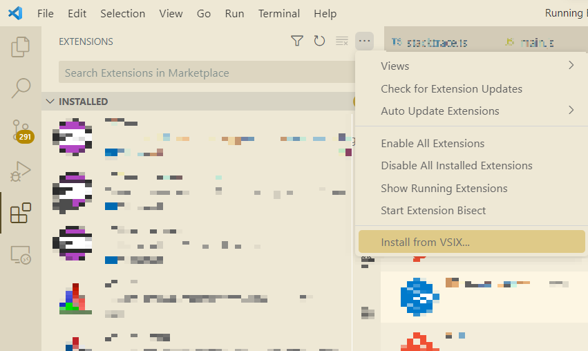

# TCF Debugging Visual Studio Code Extension Manual

## Preface

### What is the TCF Debugging Extension?

The Target Communication Framework (TCF) debugging extension allows developers to debug from Visual Studio Code a binary running on a TCF-aware debugger.

The extension uses the TCF protocol to communicate with the debugger. You may notice a `Starting TCF agent` or similar message showing up early when your debugger starts.

### Bug Reporting

If the manual is incorrect, or unclear about a topic or if you think it needs more details please report an issue.

## Getting Started

### Installation

The extension has to be manually installed from a `.vsix` file. You will not find it in the Visual Studio Marketplace yet.

#### Downloading the Extension

The extension can be downloaded from the GitHub Releases page.

Under the `Assets` link, download the `vscode-tcf-debug.vsix` file.

#### Installing in Visual Studio Code

Once you have the `.vsix` file, go to Visual Studio Code, pick the Extensions sidebar, press the `...` (three dots) button, and select `Install from VSIX...`



##### Visual Studio Code Remote Development

If you are using Visual Studio Code using a Remote Window make sure to install the extension on the remote machine.

Visual Studio Code will generally do this by default when you pick `Install from VSIX...` but if you have the extension locally installed you may have
to go into the Extensions sidebar, find the TCF extension and click `Install in (your remote name)...`

### Configuring Your Project

Visual Studio Code debugging is tied to the `launch.json` file (see [the Visual Studio Code documentation](https://code.visualstudio.com/docs/editor/debugging)). The TCF debugging extension is no exception.

You will have to create a `launch.json` file either manually or from on of the editor hints. Once you have the file you can use code completion to get something similar to this empty configuration file:

```json
{
    "version": "0.2.0",
    "configurations": [],
}
```

Next you need to configure the TCF debugging extension itself.

Inside the `configurations` section you can trigger again code completion and you will get a list of all the debugging types your Visual Studio Code installation supports.

Among them you should find the `TCF Debug: Launch` item which will generate the plain configuration with the type `tcf`:

```json
"configurations": [
    {
        "type": "tcf",
        "request": "launch",
        "name": "Debug TCF program"
    }
]
```

This empty configuration should be usually enough.

You can also manually configure the following parameters which will also auto complete (default values shown):

```
{
  "host": "127.0.0.1", // or any other hostname you want to connect to
  "port": 1534,  //or any other port where a TCF agent is listening

  "record": undefined, // use any file path here to write a log of all the TCF messages (useful for bug reports and playback)
  "playback": undefined, //use a pre-existing TCF recording to simulate a debugging session (this is obviously brittle and requires you to run close to the same commands)

  "timeout": 10000 //debug commands timeout in milliseconds (this may be useful for connection to very slow machines)

  "debugTCFMessages": false //toggle to true to see in the debug console the TCF messages being sent / received (for internal use generally)

  "pathMapper": "return function (path, context) { return path; }" //custom Javascript function providing a file path mapper from VSCode path to debuggee path; defaults to identity function.
}
```

### Launching Your Project

Note that since the extension just connects to (the TCF port provided by) the debugger, the debugged binary must *already be running* (locally or remote) and the TCF port must be accessible.

In practice you will have a local debugger running but if you are connecting to a remote machine, you may have to configure the `host` and `port` parameters (see previous section).

### Start Debugging

Once you have:

1. the extension installed
2. your project configured in `launch.json`
3. the binary running
4. through a (TCF aware) debugger

you can start debugging from Visual Studio Code.

This can be done using the normal Visual Studio Code `Run | Start Debugging` menu item or by pressing `F5`.

After starting a new debug session you will see messages in the Visual Studio Code Debug Console. You will also see your breakpoints, the call stack as well as stack variables.


Congratulations! If you got this far you have a well configured and functioning debugging extension.

## Internals

This section will explain how the extension itself is implemented. If you only need the extension to debug your own binaries, you can freely ignore it.

### Architecture

The extension is essentially a bidirectional adapter between [Debug Adapter Protocol](https://microsoft.github.io/debug-adapter-protocol/) and [Target Communication Framework](https://wiki.eclipse.org/TCF).

All the TCF logic is in the `src/tcf` folder, `src/tcf.ts` and `src/tcfclient.ts`.

TCF *commands* are implemented by subclassing `SimpleCommand` (from `tcfutils.ts`):

* serialization is done by `toBuffer`

* response de-serialization is done by `result`

* each command has a `service` name, `command` and `arguments` plus an unique message `token`.

`tcf.ts` tries to provide more lower level things while `tcfclient.ts` provides helper-like methods more easily used from the DAP side.

### Supported Visual Studio Code Versions

Since the extension has no major release yet, it will generally work with the latest Visual Studio Code. And thus we'll update [engines.vscode](https://code.visualstudio.com/api/references/extension-manifest) quite liberally.

Once a major public release exists, we may revisit and support older Visual Studio Code versions.

### Resources

VSCode:

* https://code.visualstudio.com/api/extension-guides/debugger-extension

* https://code.visualstudio.com/api/references/vscode-api#debug

TCF:

* https://download.eclipse.org/tools/tcf/tcf-docs/TCF%20Specification.html

* https://download.eclipse.org/tools/tcf/tcf-docs/TCF%20Services.html

DAP:

* https://microsoft.github.io/debug-adapter-protocol/overview

* https://microsoft.github.io/debug-adapter-protocol/specification
